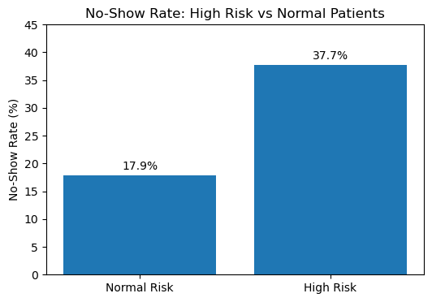

# Reducing Patient No-Show Rates – Healthcare Analytics Project

## 📌 Problem Statement
~20% of medical appointments result in no-shows, reducing provider utilization and disrupting scheduling efficiency.

## 🎯 Objective
Identify drivers of appointment no-shows and design a simple, actionable risk segmentation framework to support reminder and intervention strategies.

---

## 📊 Dataset
- 110,000+ appointment records
- Patient demographics
- Chronic condition indicators
- SMS reminder data
- Scheduling timestamps

---

## 🧹 Data Cleaning & Feature Engineering
- Standardized column names
- Converted scheduled/appointment timestamps to datetime
- Engineered `lead_time_days`
- Removed invalid negative lead times
- Removed invalid ages (age < 0)
- Created binary `no_show_flag`

---

## 🔎 Key Insights

- No-show risk increases sharply with lead time:
  - **6.6% (0–1 days)** → **33.0% (30+ days)**
- Younger patients (18–35) show higher no-show rates (~23.8%)
- SMS reminders reduce no-shows by ~6–7 percentage points for long lead-time bookings
- A rule-based high-risk segment shows **~37.7% no-show rate vs ~17.9% baseline**

---

## 📈 High-Risk vs Normal Segment

---

## 💡 Business Recommendation
Prioritize intervention workflows for:
- Long lead-time bookings
- Younger patients
- Non-chronic condition patients

Implement reminder escalation and confirmation-based scheduling.

---

## 🛠 Tools Used
- Python
- Pandas
- NumPy
- Matplotlib
- Jupyter Notebook
- Git / GitHub

---

## 📁 Repository Structure

---

## 👩‍💻 Author
Dhanashree Badgujar  
Data Analytics | Healthcare Analytics | Python